# Orchestrated Streaming App

**GitHub repository for submission:** [https://github.com/sairamraavi/Orchestrated-Streaming-App](https://github.com/sairamraavi/Orchestrated-Streaming-App)

This project demonstrates the containerization, continuous integration, orchestration, scaling, monitoring, logging, and notification workflow for a MERN streaming application. The application consists of a React frontend, four Node.js backend services (Auth, Streaming, Admin, and Chat), and MongoDB.

The source application is included in [`StreamingApp/`](StreamingApp/). Infrastructure-as-code resources are included in [`helm/streamingapp/`](helm/streamingapp/) and IAM policies in [`iam/`](iam/).

## Project Outcomes

- Ran and validated the complete application locally with Docker Compose.
- Synced the fork safely from the upstream repository.
- Built five Linux/AMD64 Docker images and stored them in private Amazon ECR repositories.
- Configured Jenkins on Amazon EC2 to build and push images on a schedule / Git change.
- Created and deployed an Amazon EKS cluster using Helm and NGINX Ingress.
- Enabled persistent MongoDB storage using an Amazon EBS `gp2` volume.
- Used IAM Roles for Service Accounts (IRSA) to upload video assets to a private Amazon S3 bucket without AWS access keys in pods.
- Enabled HPA, CloudWatch Container Insights, centralized logs, and SNS email notifications.

## Architecture

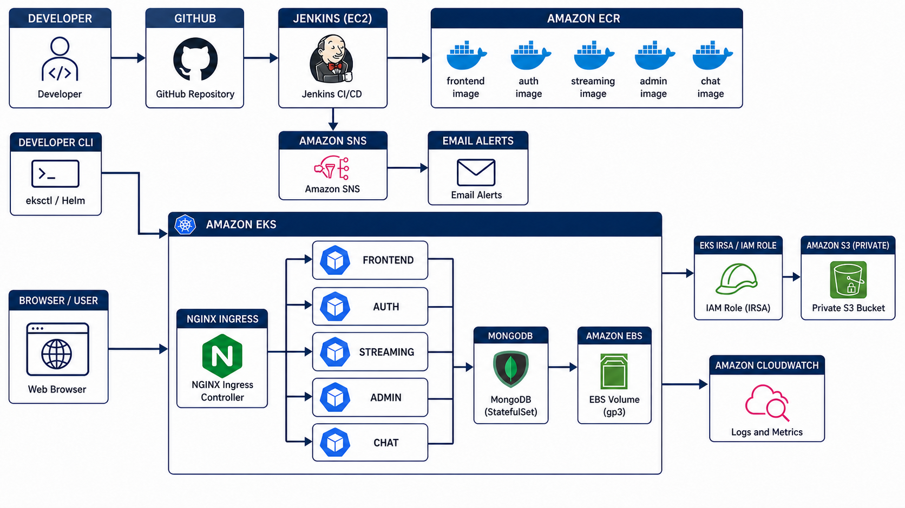

The developer pushes source code to GitHub. Jenkins runs on an EC2 instance, builds the Docker images, pushes versioned images to ECR, and sends build notifications through SNS. EKS pulls the images from ECR. An NGINX Ingress load balancer exposes the frontend and API routes. MongoDB stores application data on EBS, while the streaming service uses an IRSA IAM role to access the private S3 bucket. Container Insights sends EKS logs and metrics to CloudWatch.

## Complete Chronological Runbook

This is the complete hands-on sequence followed for this project. Replace values written as `<...>` with values from your AWS account. Never paste access keys, secret keys, JWT values, or personal email addresses into Git.

### 01 — Clone the personal fork

```bash
git clone https://github.com/sairamraavi/StreamingApp.git
cd StreamingApp
git status
```

### 02 — Confirm the personal repository is `origin`

```bash
git remote -v
```

Expected: both fetch and push URLs point to the personal `sairamraavi/StreamingApp` fork.

### 03 — Add the original project as upstream

```bash
git remote add upstream https://github.com/UnpredictablePrashant/StreamingApp.git
git remote -v
```

### 04 — Prevent accidental pushes to upstream

```bash
git remote set-url --push upstream DISABLED
git remote -v
```

Challenge: upstream initially did not exist locally, so `git fetch upstream` failed. Adding the remote fixed it.

### 05 — Fetch and compare upstream changes

```bash
git fetch upstream
git log --oneline main..upstream/main
```

An empty result means the fork is already synchronized.

### 06 — Inspect the source project and Docker configuration

```bash
ls
find . -maxdepth 3 -name Dockerfile -o -name docker-compose.yml
docker compose config --services
```

### 07 — Verify Docker Desktop

```bash
docker info
docker compose version
```

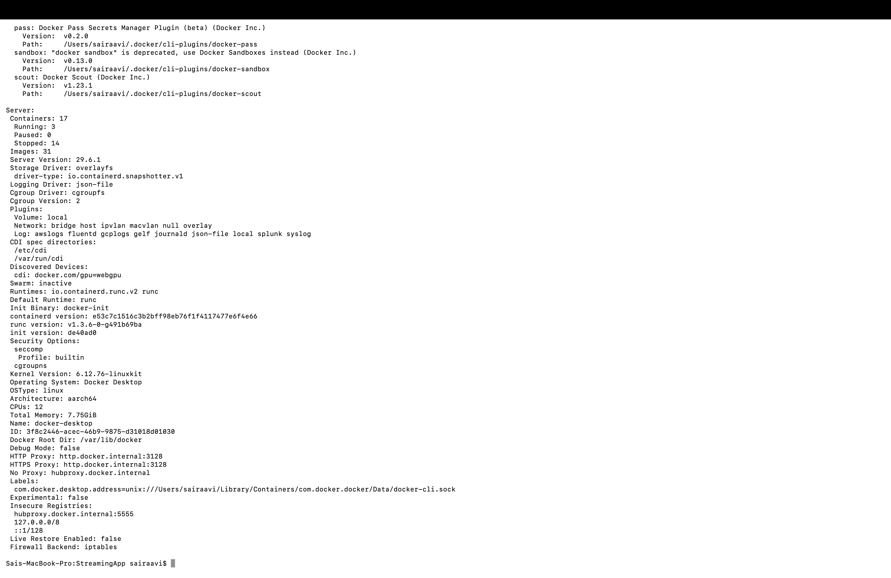

### 08 — Start the MERN application locally

```bash
docker compose up -d --build
docker compose ps
docker compose images
```

### 09 — Check local container logs when required

```bash
docker compose logs --tail=100 frontend
docker compose logs --tail=100 auth
docker compose logs --tail=100 streaming
docker compose logs --tail=100 admin
docker compose logs --tail=100 chat
```

### 10 — Validate the local frontend

Open `http://localhost:3000` and confirm that the home page loads.

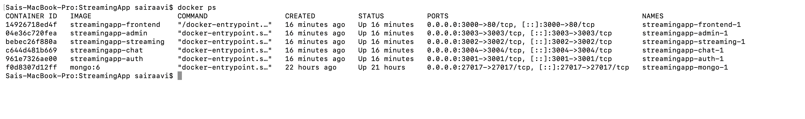


### 11 — Register and log in with a test user

Use the Register page to create a test account, then use Login with the same credentials.

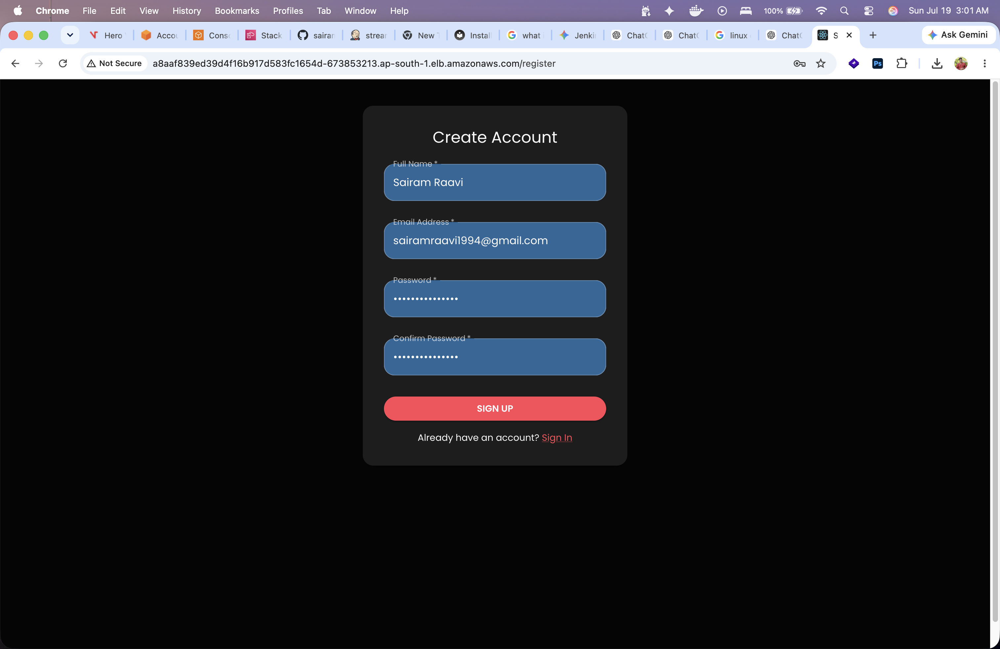

### 12 — Diagnose the initial video-upload authorization failure

The browser showed this API response:

```text
POST /api/admin/videos
403 Authorization token missing
```

This occurred because the test user was not an administrator.

### 13 — Promote the local test user to administrator

```bash
docker compose exec mongo mongosh
use streamingapp
db.users.find({}, { email: 1, role: 1 })
db.users.updateOne({ email: "<test-user-email>" }, { $set: { role: "admin" } })
exit
```

Log out and log in again so the newly issued JWT includes the admin role.

### 14 — Validate local video management

Open the Admin video-management page, upload a test video and thumbnail, then validate Browse/Collection and playback.

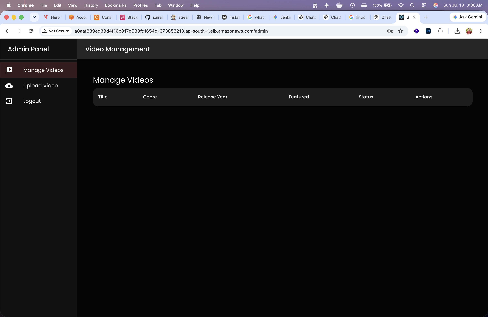

### 15 — Create the submission repository

Create `Orchestrated-Streaming-App` on GitHub, then clone it locally:

```bash
cd ..
git clone https://github.com/sairamraavi/Orchestrated-Streaming-App.git
cd Orchestrated-Streaming-App
git switch -c feature/streaming-app-setup
```

### 16 — Place the application inside the submission repository

Copy the application into the outer repository as `StreamingApp/`. Remove only its nested `.git` directory so it becomes part of the submission repository rather than a Git submodule.

```bash
git status
git add StreamingApp
git commit -m "chore: add streaming application source"
git push -u origin feature/streaming-app-setup
```

### 17 — Verify AWS CLI installation

```bash
aws --version
```

### 18 — Configure the named AWS CLI profile

```bash
aws configure --profile streamingapp
aws sts get-caller-identity --profile streamingapp
```

Expected: the returned ARN identifies the intended IAM user in AWS account `175200623108`.

### 19 — Set reusable local variables

```bash
export AWS_PROFILE=streamingapp
export AWS_REGION=ap-south-1
export AWS_ACCOUNT_ID="$(aws sts get-caller-identity --profile "$AWS_PROFILE" --query Account --output text)"
export ECR_REGISTRY="$AWS_ACCOUNT_ID.dkr.ecr.$AWS_REGION.amazonaws.com"
```

### 20 — Create private ECR repositories

```bash
for repo in streaming-frontend streaming-auth streaming-streaming streaming-admin streaming-chat
do
  aws ecr create-repository \
    --repository-name "$repo" \
    --image-scanning-configuration scanOnPush=true \
    --region "$AWS_REGION" \
    --profile "$AWS_PROFILE"
done
```

### 21 — Verify the ECR repositories

```bash
aws ecr describe-repositories \
  --region "$AWS_REGION" \
  --profile "$AWS_PROFILE" \
  --query 'repositories[].repositoryName' \
  --output table
```

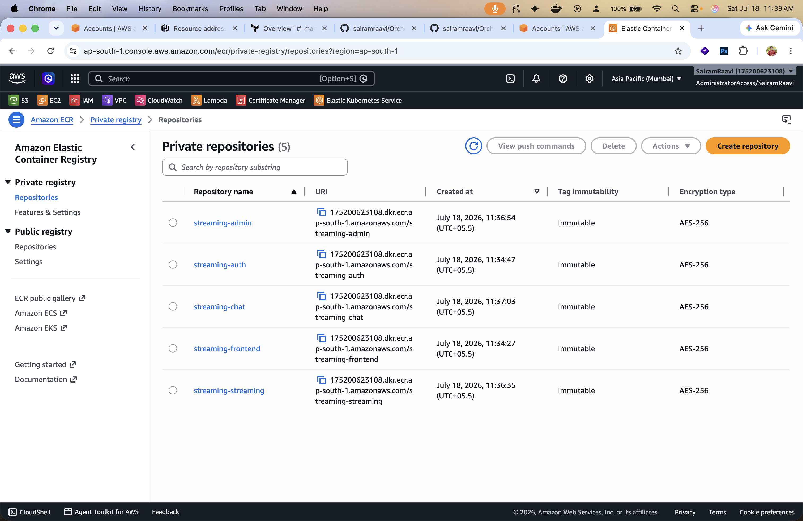

### 22 — Log Docker in to ECR

```bash
aws ecr get-login-password --region "$AWS_REGION" --profile "$AWS_PROFILE" | \
  docker login --username AWS --password-stdin "$ECR_REGISTRY"
```

### 23 — Build the frontend image for AMD64

```bash
export IMAGE_TAG=manual-amd64-v1
docker buildx build --platform linux/amd64 \
  -t "$ECR_REGISTRY/streaming-frontend:$IMAGE_TAG" \
  --push StreamingApp/frontend
```

### 24 — Build the Auth image for AMD64

```bash
docker buildx build --platform linux/amd64 \
  -t "$ECR_REGISTRY/streaming-auth:$IMAGE_TAG" \
  --push StreamingApp/backend/authService
```

### 25 — Build the Streaming image for AMD64

```bash
docker buildx build --platform linux/amd64 \
  -t "$ECR_REGISTRY/streaming-streaming:$IMAGE_TAG" \
  --push StreamingApp/backend/streamingService
```

### 26 — Build the Admin image for AMD64

```bash
docker buildx build --platform linux/amd64 \
  -t "$ECR_REGISTRY/streaming-admin:$IMAGE_TAG" \
  --push StreamingApp/backend/adminService
```

### 27 — Build the Chat image for AMD64

```bash
docker buildx build --platform linux/amd64 \
  -t "$ECR_REGISTRY/streaming-chat:$IMAGE_TAG" \
  --push StreamingApp/backend/chatService
```

### 28 — Verify the image architecture and ECR tags

```bash
docker image inspect streamingapp-frontend:amd64 --format '{{.Os}}/{{.Architecture}}'

for repo in streaming-frontend streaming-auth streaming-streaming streaming-admin streaming-chat
do
  echo "$repo"
  aws ecr describe-images --repository-name "$repo" --region "$AWS_REGION" \
    --profile "$AWS_PROFILE" --query 'imageDetails[].imageTags' --output table
done
```

Challenge: the Mac creates ARM64 images by default. `docker buildx build --platform linux/amd64` was required because EKS worker nodes are AMD64.

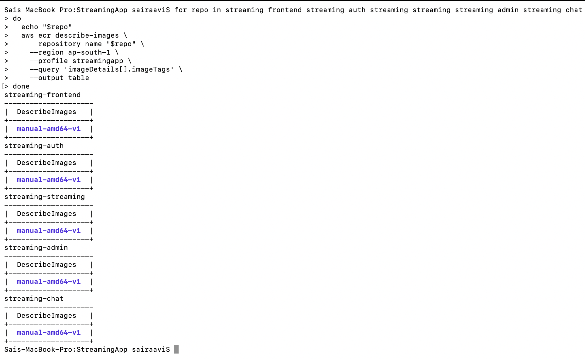

### 29 — Identify the Jenkins EC2 instance

```bash
aws ec2 describe-instances \
  --filters "Name=instance-state-name,Values=running" \
  --query 'Reservations[*].Instances[*].[InstanceId,InstanceType,PublicIpAddress,Tags[?Key==`Name`].Value | [0]]' \
  --output table
```

### 30 — Check whether the Jenkins EC2 instance has an IAM role

```bash
aws ec2 describe-instances \
  --instance-ids i-051c047fe1f8499ef \
  --region "$AWS_REGION" \
  --profile "$AWS_PROFILE" \
  --query 'Reservations[0].Instances[0].[InstanceId,InstanceType,IamInstanceProfile.Arn]' \
  --output table
```

The initial result was `None`; an IAM instance profile was subsequently attached.

### 31 — Validate the Jenkins EC2 IAM role

Connect to the server and run:

```bash
aws sts get-caller-identity --region ap-south-1
```

Expected: an assumed-role ARN for `StreamingApp-Jenkins-EC2-Role`.

### 32 — Install Docker and authorize Jenkins to use it

On the Jenkins EC2 instance:

```bash
sudo docker run hello-world
sudo usermod -aG docker "$USER"
sudo usermod -aG docker jenkins
sudo systemctl restart jenkins
sudo -u jenkins docker run hello-world
```

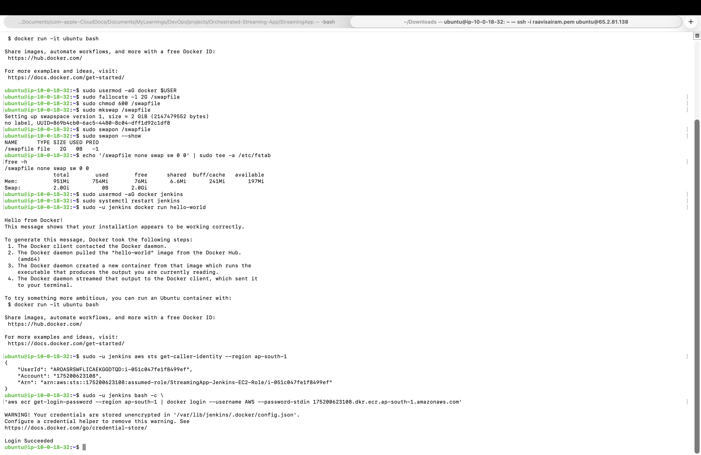

### 33 — Verify Jenkins build prerequisites

```bash
git --version
docker --version
sudo -u jenkins docker version
aws sts get-caller-identity --region ap-south-1
```

### 34 — Add swap to the constrained Jenkins EC2 instance

```bash
sudo fallocate -l 2G /swapfile
sudo chmod 600 /swapfile
sudo mkswap /swapfile
sudo swapon /swapfile
echo '/swapfile swap swap defaults 0 0' | sudo tee -a /etc/fstab
free -h
```

Challenge: the `t2.micro` instance has about 1 GB RAM. Docker builds initially exhausted memory; the swap file allowed builds to finish.

### 35 — Check Jenkins disk capacity and clean Docker cache when necessary

```bash
df -h /
sudo docker system df
sudo docker system prune -af
df -h /
```

Challenge: downloading tools failed with `curl: (23) Failure writing output to destination` when Docker build cache filled disk space. Pruning unused Docker data recovered storage.

### 36 — Configure Jenkins plugins and job

In Jenkins, install/confirm: Pipeline, Git, GitHub, Credentials Binding, Pipeline Stage View, and Blue Ocean. Create a Pipeline job named `streamingapp-ecr-ci` using Pipeline script from SCM.

```text
Repository: https://github.com/sairamraavi/Orchestrated-Streaming-App.git
Branch: */feature/streaming-app-setup
Script path: Jenkinsfile
```

### 37 — Configure the Jenkins poll trigger

Set Poll SCM to:

```text
H/5 * * * *
```

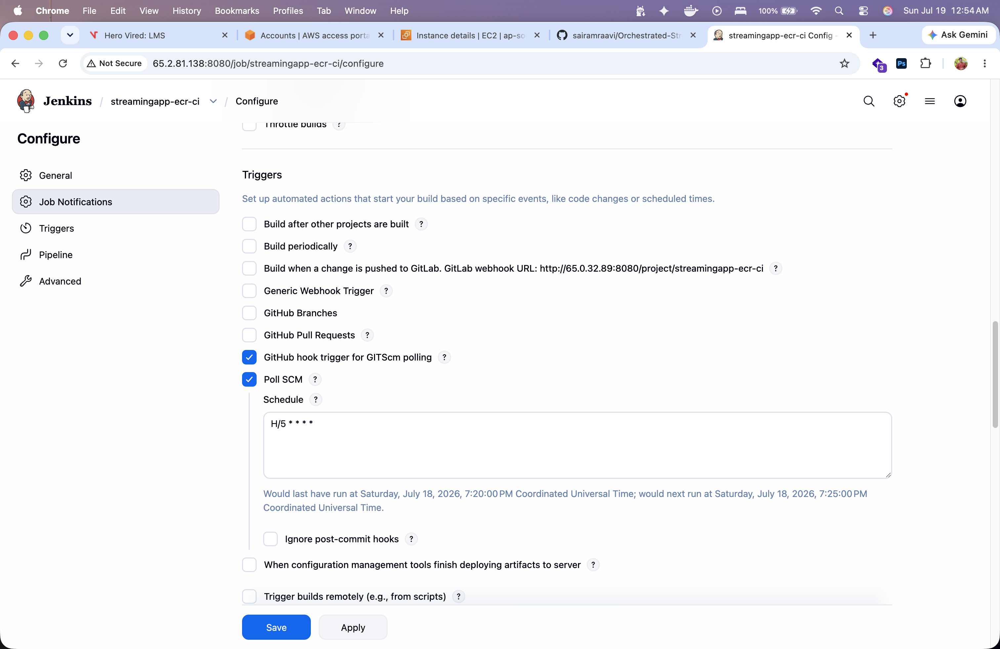

### 38 — Commit and push the Jenkins pipeline

```bash
git add Jenkinsfile
git commit -m "ci: build and push application images to ecr"
git push origin feature/streaming-app-setup
```

### 39 — Run and validate the Jenkins ECR pipeline

Use **Build with Parameters** in Jenkins and retain the default AWS Region and SNS topic values. Confirm that Checkout, Preflight, ECR Login, Build Images, and Push Images to ECR are all green.

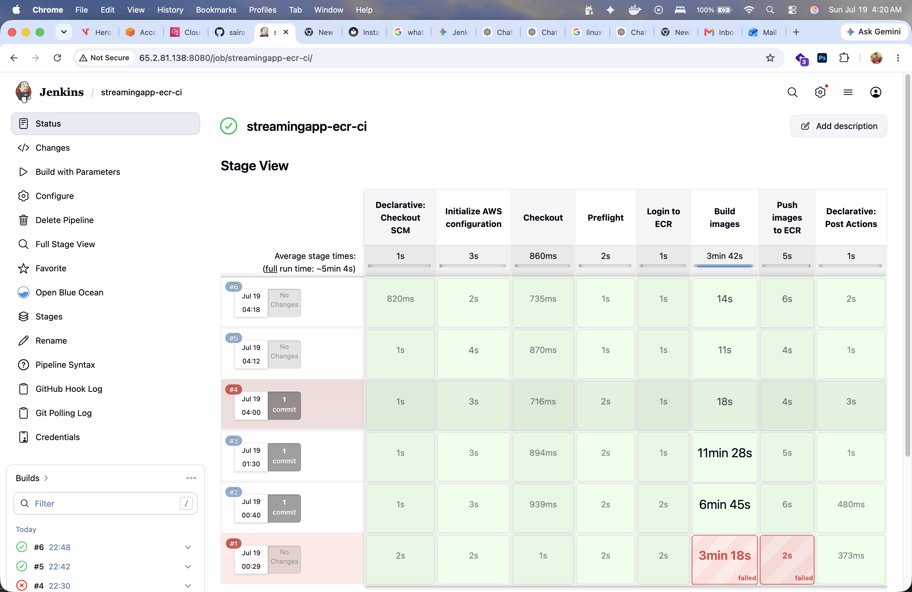

### 40 — Verify Kubernetes tools on the Mac

```bash
kubectl version --client
eksctl version
helm version --short
```

### 41 — Create the EKS cluster

```bash
AWS_PROFILE="$AWS_PROFILE" eksctl create cluster \
  --name streaming-eks \
  --region "$AWS_REGION" \
  --nodegroup-name app-nodes \
  --node-type t3.medium \
  --nodes 2 \
  --nodes-min 2 \
  --nodes-max 3 \
  --managed
```

### 42 — Configure kubectl and validate EKS nodes

```bash
aws eks update-kubeconfig --name streaming-eks --region "$AWS_REGION" --profile "$AWS_PROFILE"
kubectl get nodes
```

Expected: two `Ready` nodes.

### 43 — Install the NGINX Ingress Controller

```bash
helm upgrade --install ingress-nginx ingress-nginx \
  --repo https://kubernetes.github.io/ingress-nginx \
  --namespace ingress-nginx \
  --create-namespace

kubectl wait --namespace ingress-nginx \
  --for=condition=Ready pod \
  --selector=app.kubernetes.io/component=controller \
  --timeout=180s

kubectl get service ingress-nginx-controller -n ingress-nginx
```

### 44 — Create the application namespace and JWT secret

```bash
kubectl create namespace streamingapp
kubectl create secret generic streamingapp-secrets \
  --namespace streamingapp \
  --from-literal=jwt-secret="$(openssl rand -base64 48)"
kubectl get secret streamingapp-secrets -n streamingapp
```

### 45 — Validate the Helm manifest before deployment

```bash
helm lint ./helm/streamingapp
helm template streamingapp ./helm/streamingapp --namespace streamingapp \
  > /private/tmp/streamingapp-rendered.yaml
kubectl apply --dry-run=server --namespace streamingapp \
  -f /private/tmp/streamingapp-rendered.yaml
```

### 46 — Install the Helm release

```bash
helm upgrade --install streamingapp ./helm/streamingapp \
  --namespace streamingapp \
  --set image.tag=jenkins-3 \
  --wait \
  --timeout 10m
```

### 47 — Diagnose the pending MongoDB PVC

```bash
kubectl get pods,pvc -n streamingapp
kubectl get storageclass
kubectl get events -n streamingapp --sort-by=.lastTimestamp | tail -20
```

Challenge: the PVC showed `Pending` and events stated that no storage class was set. Backend services then crash-looped because MongoDB could not start.

### 48 — Correct the Helm MongoDB storage class

Set `storageClassName: gp2` in `helm/streamingapp/templates/mongodb.yaml`, then re-render and verify it:

```bash
helm template streamingapp ./helm/streamingapp --namespace streamingapp \
  > /private/tmp/streamingapp-rendered.yaml
grep -n -C 2 -E 'storageClassName|accessModes' /private/tmp/streamingapp-rendered.yaml
```

Challenge: `rg` was not installed in the terminal, so `grep` was used instead.

### 49 — Create the EBS CSI IAM role

```bash
AWS_PROFILE="$AWS_PROFILE" eksctl create iamserviceaccount \
  --cluster streaming-eks \
  --region "$AWS_REGION" \
  --namespace kube-system \
  --name ebs-csi-controller-sa \
  --role-name AmazonEKS_EBS_CSI_DriverRole \
  --role-only \
  --attach-policy-arn arn:aws:iam::aws:policy/AmazonEBSCSIDriverPolicyV2 \
  --approve
```

### 50 — Fix the initial EBS CSI policy ARN error

The first policy ARN incorrectly included `service-role/` and CloudFormation returned a 404. Identify the valid policy and rerun the preceding command with the exact V2 ARN:

```bash
aws iam list-policies --scope AWS --profile "$AWS_PROFILE" \
  --query "Policies[?contains(PolicyName, 'AmazonEBSCSIDriver')].[PolicyName,Arn]" \
  --output table
```

### 51 — Install the EBS CSI add-on

```bash
aws eks create-addon \
  --cluster-name streaming-eks \
  --addon-name aws-ebs-csi-driver \
  --service-account-role-arn "<EBS_CSI_ROLE_ARN>" \
  --region "$AWS_REGION" \
  --profile "$AWS_PROFILE"

aws eks describe-addon --cluster-name streaming-eks \
  --addon-name aws-ebs-csi-driver --region "$AWS_REGION" \
  --profile "$AWS_PROFILE"
```

### 52 — Re-run Helm and verify all pods become healthy

```bash
helm upgrade --install streamingapp ./helm/streamingapp \
  --namespace streamingapp --set image.tag=jenkins-3 --wait --timeout 10m

kubectl get pods,pvc,svc,ingress -n streamingapp
```

Expected: six pods are `Running`, `mongodb-data` is `Bound`, and the ingress has an ELB address.

### 53 — Create the private S3 bucket

```bash
export S3_BUCKET="streamingapp-$AWS_ACCOUNT_ID-$AWS_REGION"

aws s3api create-bucket --bucket "$S3_BUCKET" --region "$AWS_REGION" \
  --create-bucket-configuration LocationConstraint="$AWS_REGION" \
  --profile "$AWS_PROFILE"

aws s3api put-public-access-block --bucket "$S3_BUCKET" \
  --public-access-block-configuration \
  'BlockPublicAcls=true,IgnorePublicAcls=true,BlockPublicPolicy=true,RestrictPublicBuckets=true' \
  --profile "$AWS_PROFILE"
```

### 54 — Verify S3 public access is blocked

```bash
aws s3api get-public-access-block --bucket "$S3_BUCKET" --profile "$AWS_PROFILE"
```

### 55 — Create the least-privilege S3 IAM policy

The policy document is stored in `iam/streamingapp-s3-policy.json`.

```bash
aws iam create-policy \
  --policy-name StreamingAppS3Policy \
  --policy-document file://iam/streamingapp-s3-policy.json \
  --profile "$AWS_PROFILE"
```

### 56 — Create the EKS IRSA service account

```bash
AWS_PROFILE="$AWS_PROFILE" eksctl create iamserviceaccount \
  --cluster streaming-eks \
  --region "$AWS_REGION" \
  --namespace streamingapp \
  --name streamingapp-s3 \
  --role-name StreamingAppS3Role \
  --attach-policy-arn "<STREAMINGAPP_S3_POLICY_ARN>" \
  --approve

kubectl get serviceaccount streamingapp-s3 -n streamingapp -o yaml
```

### 57 — Redeploy Helm with the S3/IRSA configuration

```bash
helm upgrade --install streamingapp ./helm/streamingapp \
  --namespace streamingapp \
  --set image.tag=jenkins-3 \
  --wait --timeout 10m
```

### 58 — Validate deployed registration, login, upload, browse, and playback

```bash
kubectl get ingress streamingapp -n streamingapp
```

Open `http://<INGRESS-ADDRESS>`, register/login, promote the test user to admin in MongoDB if needed, upload a video, then test Browse and playback.

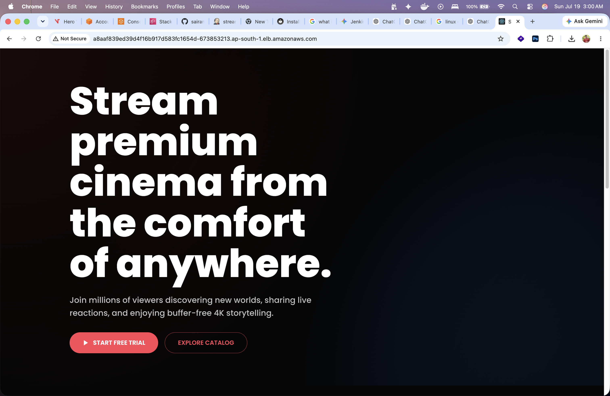

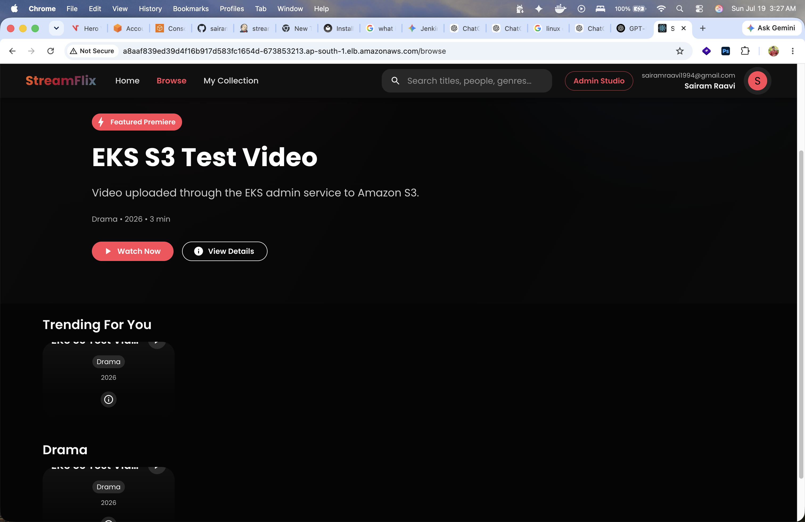

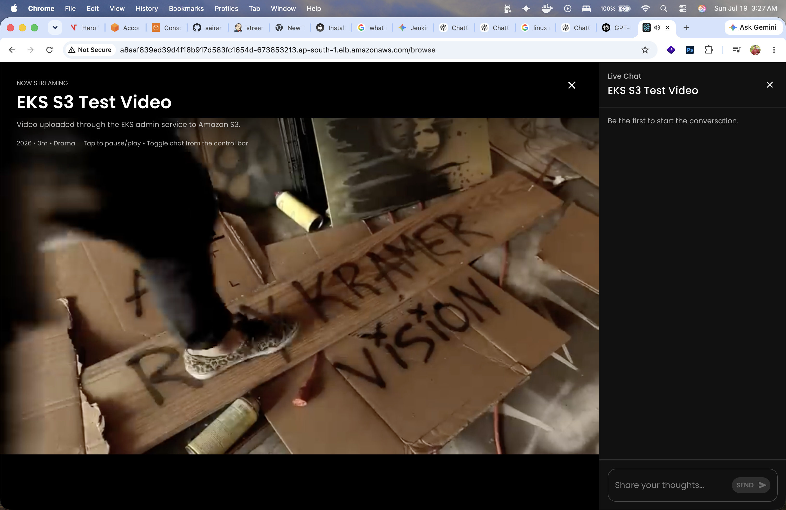

### 59 — Verify objects reached S3

```bash
aws s3 ls "s3://$S3_BUCKET" --recursive --profile "$AWS_PROFILE"
```

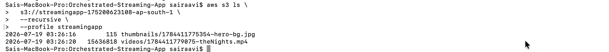

### 60 — Verify Horizontal Pod Autoscalers

```bash
kubectl get hpa -n streamingapp
kubectl top pods -n streamingapp
```

Challenge: HPA needs metrics-server. It was available as an EKS add-on before validation.

### 61 — Create the CloudWatch Observability IAM role

Create an IAM role for the CloudWatch Observability EKS add-on and attach `CloudWatchAgentServerPolicy`. The role ARN is then used in the next command.

### 62 — Enable the CloudWatch Observability EKS add-on

```bash
aws eks create-addon \
  --cluster-name streaming-eks \
  --addon-name amazon-cloudwatch-observability \
  --service-account-role-arn "<CLOUDWATCH_OBSERVABILITY_ROLE_ARN>" \
  --region "$AWS_REGION" \
  --profile "$AWS_PROFILE"

aws eks describe-addon --cluster-name streaming-eks \
  --addon-name amazon-cloudwatch-observability \
  --region "$AWS_REGION" --profile "$AWS_PROFILE"
```

### 63 — Verify CloudWatch logs and metrics

In CloudWatch, verify Container Insights and the `application`, `host`, and `dataplane` log groups for `streaming-eks`.

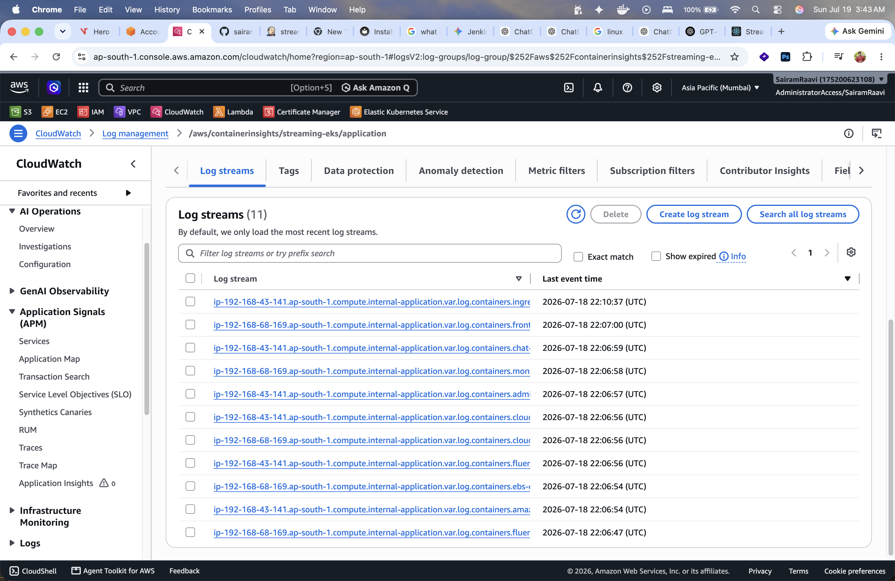

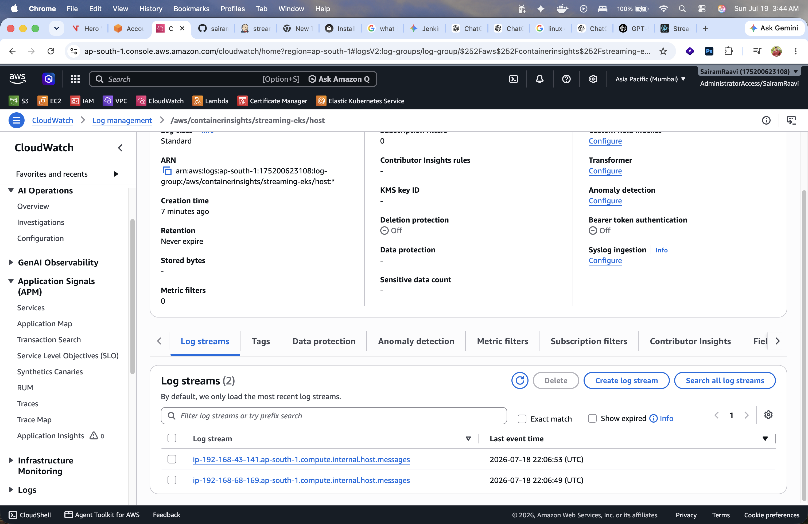

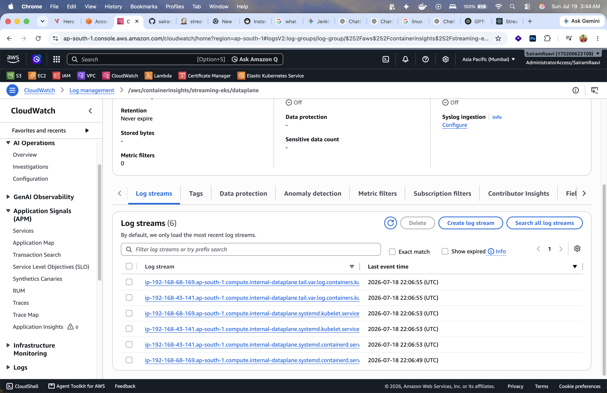

### 64 — Create the SNS alert topic

```bash
aws sns create-topic --name streamingapp-alerts \
  --region "$AWS_REGION" --profile "$AWS_PROFILE"
```

### 65 — Add and confirm an SNS email subscription

```bash
aws sns subscribe \
  --topic-arn "<SNS_TOPIC_ARN>" \
  --protocol email \
  --notification-endpoint "<email-address>" \
  --region "$AWS_REGION" \
  --profile "$AWS_PROFILE"

aws sns list-subscriptions-by-topic --topic-arn "<SNS_TOPIC_ARN>" \
  --region "$AWS_REGION" --profile "$AWS_PROFILE" \
  --query 'Subscriptions[].[Protocol,SubscriptionArn]' --output table
```

Open the confirmation link received in the inbox.

### 66 — Resolve the Jenkins AWS CLI SNS error

The original EC2 AWS CLI returned `badly formed help string` for `aws sns publish`. The official AWS CLI v2 was installed under `/usr/local/bin/aws`, then confirmed as the Jenkins user:

```bash
which aws
aws --version
sudo -u jenkins which aws
sudo -u jenkins aws --version
```

### 67 — Test SNS publishing from Jenkins EC2

```bash
sudo -u jenkins aws sns publish \
  --region ap-south-1 \
  --topic-arn "<SNS_TOPIC_ARN>" \
  --subject 'StreamingApp SNS test' \
  --message 'Jenkins EC2 role can publish to SNS.'
```

Expected: an SNS `MessageId` is returned and the confirmed subscription receives the email.

### 68 — Commit final documentation and submit the repository link

```bash
git status
git add README.md screenshots/ Jenkinsfile helm/ iam/ StreamingApp/
git commit -m "docs: add complete orchestration and scaling project runbook"
git push origin feature/streaming-app-setup
```

Open a pull request or merge the completed branch into `main` when ready. Submit the GitHub repository URL in the requested text, Word, or PDF file through Vlearn.

## Repository and Version Control

The project was forked into the personal GitHub account. The original project is configured as a fetch-only upstream remote, so no changes can accidentally be pushed to it.

```bash
git remote add upstream https://github.com/UnpredictablePrashant/StreamingApp.git
git remote set-url --push upstream DISABLED
git fetch upstream
git log --oneline main..upstream/main
```

When upstream contains changes, review them before merging:

```bash
git switch main
git fetch upstream
git log --oneline main..upstream/main
git merge upstream/main
git push origin main
```

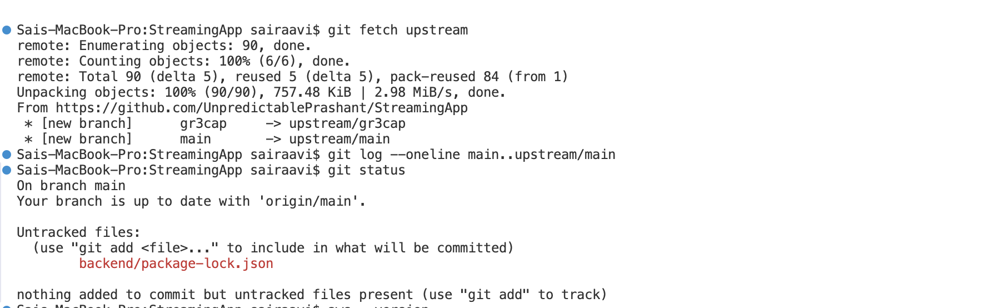

## Local Development Environment

Prerequisites installed on the development Mac:

- Docker Desktop and Docker Compose
- Git
- AWS CLI v2
- `kubectl`, `eksctl`, and Helm

Verify Docker Desktop is running:

```bash
docker info
docker compose images
```

Start the application from the source folder:

```bash
cd StreamingApp
docker compose up -d --build
docker compose ps
```

The local service endpoints are:

| Component | Local endpoint |
| --- | --- |
| Frontend | `http://localhost:3000` |
| Auth API | `http://localhost:3001` |
| Streaming API | `http://localhost:3002` |
| Admin API | `http://localhost:3003` |
| Chat API | `http://localhost:3004` |

Stop the local environment when finished:

```bash
docker compose down
```


## Local Application Validation

The following user flows were tested locally:

- Created a test user through Register.
- Logged in successfully.
- Promoted the test user to an admin user for video management.
- Uploaded a video, browsed the collection, played a video, and tested the chat player.

MongoDB was used only for the local admin-role test:

```bash
docker compose exec mongo mongosh
use streamingapp
db.users.updateOne({ email: "<test-user-email>" }, { $set: { role: "admin" } })
exit
```


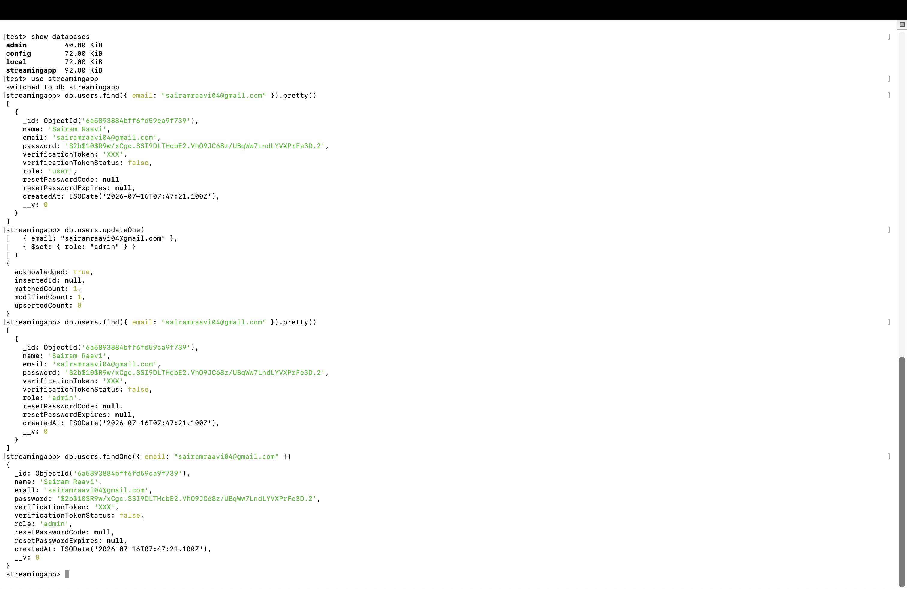


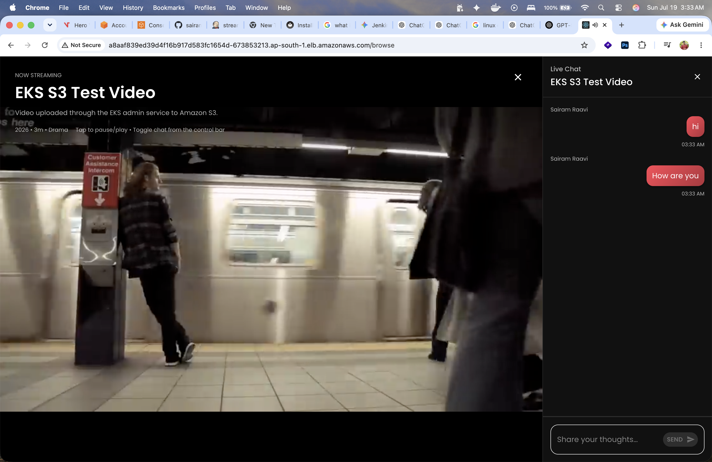

## AWS CLI Configuration

An IAM user with the required AWS permissions was created and configured using a named AWS CLI profile. Access keys are never committed to Git.

```bash
aws configure --profile streamingapp
aws sts get-caller-identity --profile streamingapp
aws --version
```

The deployment region is `ap-south-1`.

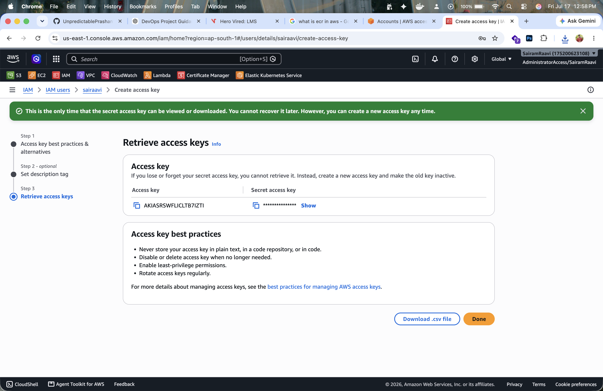

## Docker Image Build

The local Mac is ARM-based, while the Jenkins EC2 server and EKS worker nodes are AMD64. Therefore, the ECR images were built for `linux/amd64`.

```bash
export AWS_REGION=ap-south-1
export AWS_ACCOUNT_ID="$(aws sts get-caller-identity --profile streamingapp --query Account --output text)"
export ECR_REGISTRY="$AWS_ACCOUNT_ID.dkr.ecr.$AWS_REGION.amazonaws.com"
export IMAGE_TAG=manual-amd64-v1

docker buildx build --platform linux/amd64 \
  -t "$ECR_REGISTRY/streaming-frontend:$IMAGE_TAG" \
  --push StreamingApp/frontend
```

The same pattern was used for the four backend service build contexts:

```bash
docker buildx build --platform linux/amd64 -t "$ECR_REGISTRY/streaming-auth:$IMAGE_TAG" --push StreamingApp/backend/authService
docker buildx build --platform linux/amd64 -t "$ECR_REGISTRY/streaming-streaming:$IMAGE_TAG" --push StreamingApp/backend/streamingService
docker buildx build --platform linux/amd64 -t "$ECR_REGISTRY/streaming-admin:$IMAGE_TAG" --push StreamingApp/backend/adminService
docker buildx build --platform linux/amd64 -t "$ECR_REGISTRY/streaming-chat:$IMAGE_TAG" --push StreamingApp/backend/chatService
```

Verify the image platform:

```bash
docker image inspect streamingapp-frontend:amd64 --format '{{.Os}}/{{.Architecture}}'
```

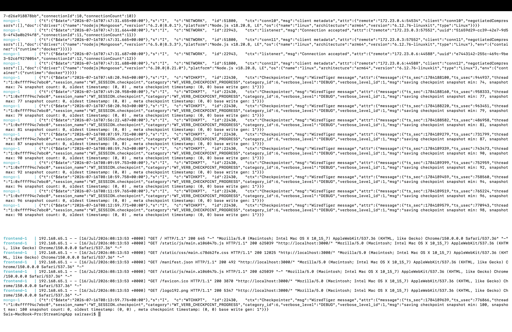

## Amazon ECR

Five private ECR repositories were created, one for each deployable application component.

```bash
for repo in streaming-frontend streaming-auth streaming-streaming streaming-admin streaming-chat
do
  aws ecr create-repository \
    --repository-name "$repo" \
    --image-scanning-configuration scanOnPush=true \
    --region ap-south-1 \
    --profile streamingapp
done
```

Authenticate Docker to ECR and verify pushed tags:

```bash
aws ecr get-login-password --region ap-south-1 --profile streamingapp | \
  docker login --username AWS --password-stdin "$ECR_REGISTRY"

aws ecr describe-images \
  --repository-name streaming-frontend \
  --region ap-south-1 \
  --profile streamingapp \
  --query 'imageDetails[].imageTags' \
  --output table
```

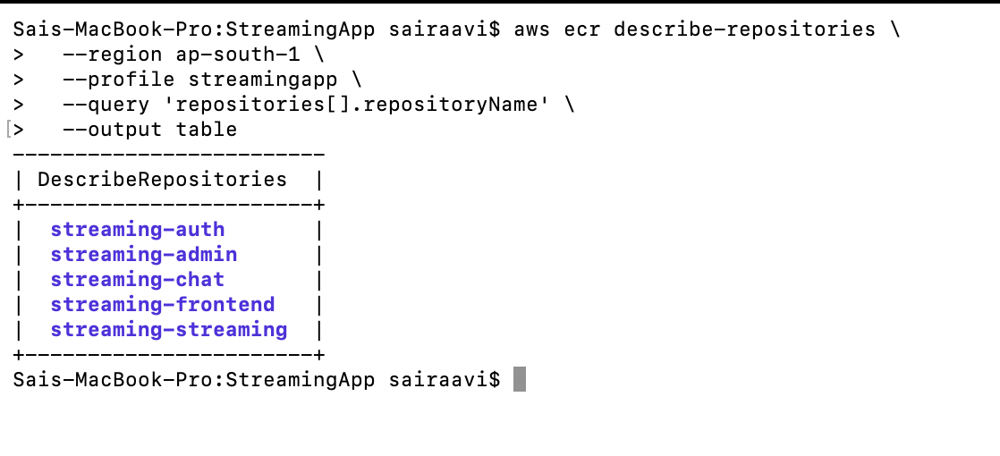


## Jenkins Continuous Integration

Jenkins is hosted on an existing Ubuntu EC2 instance. Docker was installed on the same instance because the Jenkins pipeline uses Docker to build the application images and Docker login/push to ECR. The EC2 instance uses an IAM role rather than long-lived AWS access keys.

The role was granted ECR permissions and an inline SNS publish permission. Jenkins was added to the `docker` group and validated:

```bash
sudo usermod -aG docker jenkins
sudo systemctl restart jenkins
sudo -u jenkins docker run hello-world
sudo -u jenkins aws sts get-caller-identity --region ap-south-1
```

Because the Jenkins controller has limited memory, a 2 GB swap file was enabled:

```bash
sudo fallocate -l 2G /swapfile
sudo chmod 600 /swapfile
sudo mkswap /swapfile
sudo swapon /swapfile
echo '/swapfile swap swap defaults 0 0' | sudo tee -a /etc/fstab
free -h
```

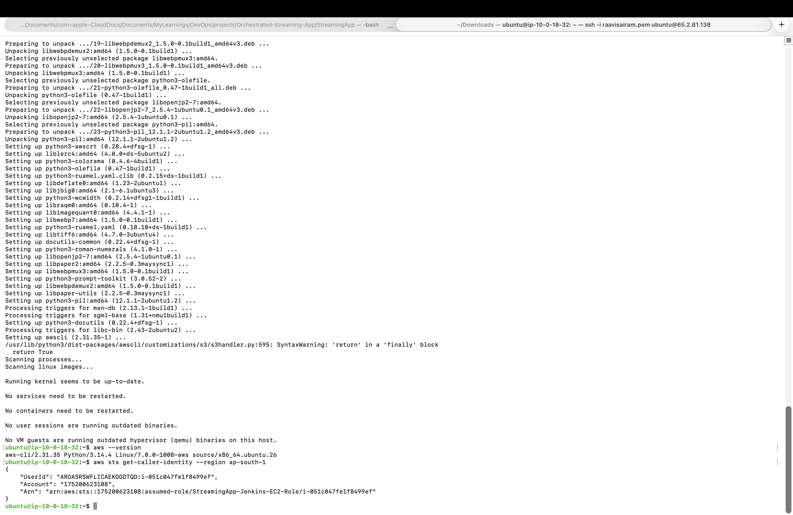


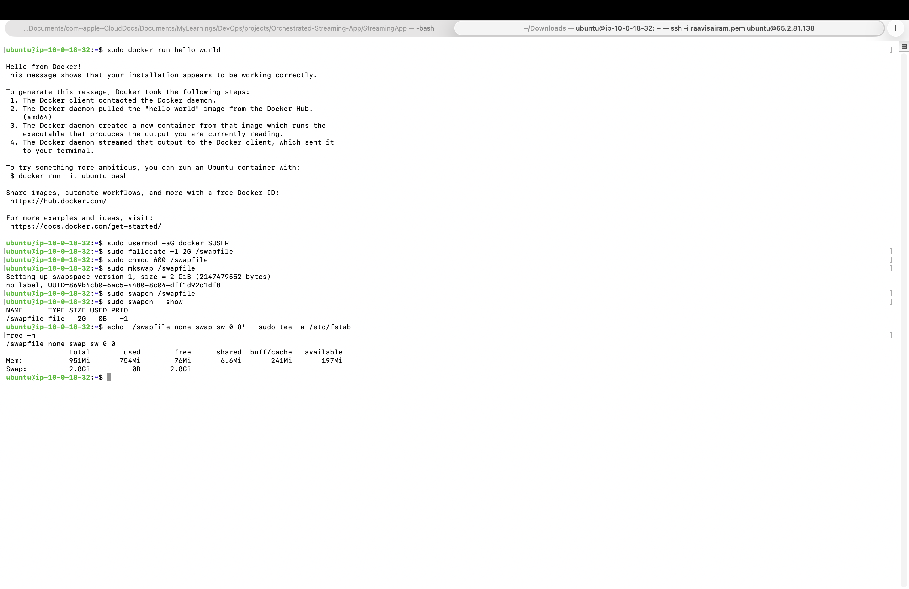

The Jenkins pipeline is defined in the root [`Jenkinsfile`](Jenkinsfile). It dynamically obtains the AWS account ID and creates an immutable image tag based on the Jenkins build number:

```groovy
AWS_ACCOUNT_ID = sh(script: 'aws sts get-caller-identity --query Account --output text', returnStdout: true).trim()
ECR_REGISTRY = "${AWS_ACCOUNT_ID}.dkr.ecr.${AWS_REGION}.amazonaws.com"
IMAGE_TAG = "jenkins-${BUILD_NUMBER}"
```

The pipeline performs these actions:

- Checks out the GitHub branch.
- Validates AWS, Docker, Git, and ECR repositories.
- Logs in to ECR using the EC2 IAM role.
- Builds all five AMD64 images.
- Pushes each versioned image to its ECR repository.
- Publishes a success or failure SNS notification.

Jenkins job configuration:

```text
Pipeline definition: Pipeline script from SCM
Repository: https://github.com/sairamraavi/Orchestrated-Streaming-App.git
Branch: */feature/streaming-app-setup
Script path: Jenkinsfile
Poll SCM: H/5 * * * *
```

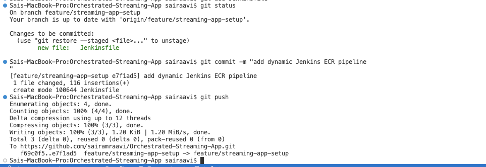


## Amazon EKS Cluster

The EKS tools were verified locally:

```bash
kubectl version --client
eksctl version
helm version --short
```

The cluster was created in `ap-south-1` with two worker nodes:

```bash
AWS_PROFILE=streamingapp eksctl create cluster \
  --name streaming-eks \
  --region ap-south-1 \
  --nodegroup-name app-nodes \
  --node-type t3.medium \
  --nodes 2 \
  --nodes-min 2 \
  --nodes-max 3 \
  --managed

aws eks update-kubeconfig --name streaming-eks --region ap-south-1 --profile streamingapp
kubectl get nodes
```

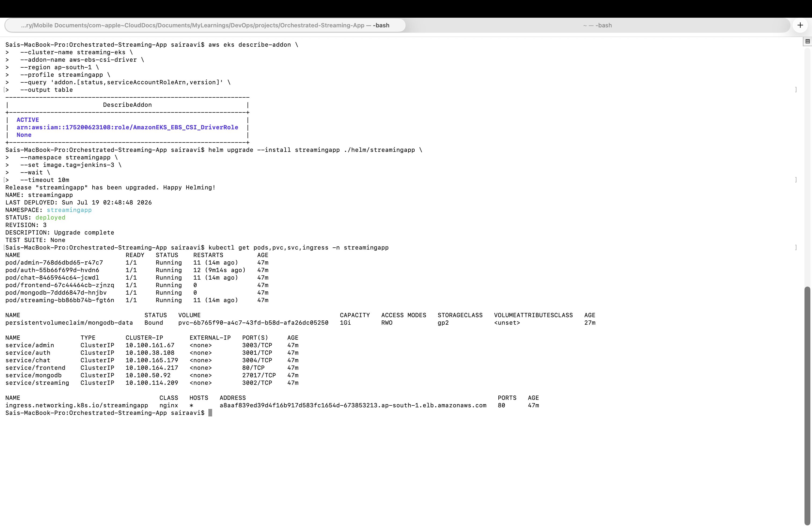

## NGINX Ingress

The NGINX Ingress Controller was installed through Helm to provide a single AWS load balancer and path-based routing.

```bash
helm upgrade --install ingress-nginx ingress-nginx \
  --repo https://kubernetes.github.io/ingress-nginx \
  --namespace ingress-nginx \
  --create-namespace

kubectl wait --namespace ingress-nginx \
  --for=condition=Ready pod \
  --selector=app.kubernetes.io/component=controller \
  --timeout=180s

kubectl get service ingress-nginx-controller -n ingress-nginx
```

Routing implemented by the Helm chart:

| Path | Kubernetes service |
| --- | --- |
| `/` | frontend |
| `/api` | auth |
| `/api/streaming` | streaming |
| `/api/admin` | admin |
| `/api/chat` and `/socket.io` | chat |

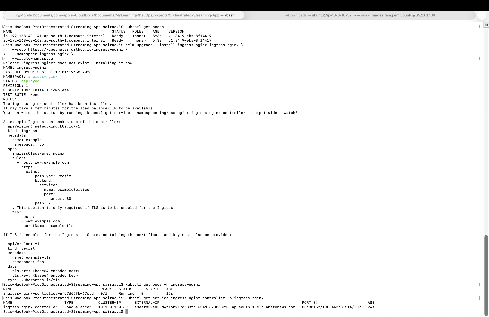

## Persistent MongoDB Storage

MongoDB requires persistent storage. The initial PVC was pending because the EBS CSI driver was not installed. The EBS CSI add-on and its IAM role were then configured, and the PVC bound successfully using the `gp2` storage class.

```bash
AWS_PROFILE=streamingapp eksctl create iamserviceaccount \
  --cluster streaming-eks \
  --region ap-south-1 \
  --namespace kube-system \
  --name ebs-csi-controller-sa \
  --role-name AmazonEKS_EBS_CSI_DriverRole \
  --role-only \
  --attach-policy-arn arn:aws:iam::aws:policy/AmazonEBSCSIDriverPolicyV2 \
  --approve

aws eks create-addon \
  --cluster-name streaming-eks \
  --addon-name aws-ebs-csi-driver \
  --service-account-role-arn "<EBS_CSI_ROLE_ARN>" \
  --region ap-south-1 \
  --profile streamingapp

kubectl get storageclass
kubectl get pvc -n streamingapp
```

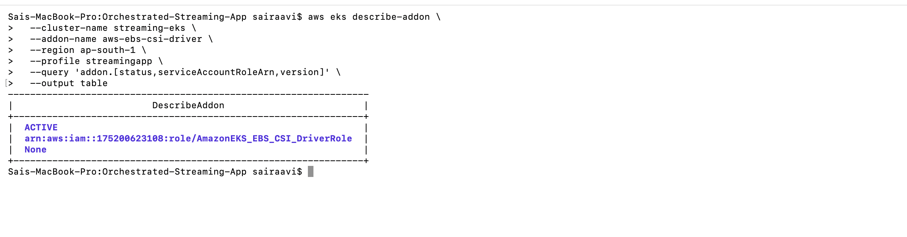

## Helm Deployment

The application is packaged as the Helm chart in [`helm/streamingapp/`](helm/streamingapp/). It creates deployments and services for frontend, Auth, Streaming, Admin, Chat, and MongoDB; a PVC; ingress; and HPAs.

Create the namespace and application secret before installation:

```bash
kubectl create namespace streamingapp
kubectl create secret generic streamingapp-secrets \
  --namespace streamingapp \
  --from-literal=jwt-secret="$(openssl rand -base64 48)"
```

Validate the chart, then deploy a Jenkins-produced tag:

```bash
helm lint ./helm/streamingapp

helm template streamingapp ./helm/streamingapp \
  --namespace streamingapp > /private/tmp/streamingapp-rendered.yaml

kubectl apply --dry-run=server \
  --namespace streamingapp \
  -f /private/tmp/streamingapp-rendered.yaml

helm upgrade --install streamingapp ./helm/streamingapp \
  --namespace streamingapp \
  --set image.tag=jenkins-3 \
  --wait \
  --timeout 10m
```

Verify deployment resources:

```bash
kubectl get pods,pvc,svc,ingress -n streamingapp
helm status streamingapp -n streamingapp
```

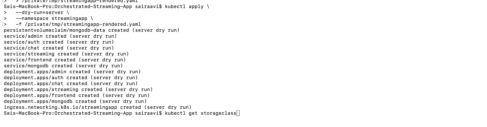

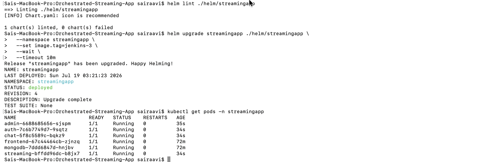

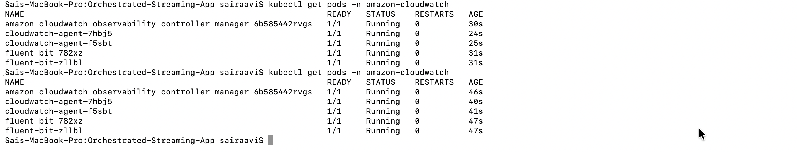

## Private Amazon S3 Video Storage

A private S3 bucket stores uploaded videos and thumbnails. Public access is blocked. The streaming workload accesses it through IRSA, so access keys are not stored in Kubernetes manifests or containers.

Create the bucket and verify public access protection:

```bash
export S3_BUCKET="streamingapp-<account-id>-ap-south-1"

aws s3api create-bucket \
  --bucket "$S3_BUCKET" \
  --region ap-south-1 \
  --create-bucket-configuration LocationConstraint=ap-south-1 \
  --profile streamingapp

aws s3api put-public-access-block \
  --bucket "$S3_BUCKET" \
  --public-access-block-configuration \
  'BlockPublicAcls=true,IgnorePublicAcls=true,BlockPublicPolicy=true,RestrictPublicBuckets=true' \
  --profile streamingapp

aws s3api get-public-access-block --bucket "$S3_BUCKET" --profile streamingapp
```

Create the IRSA service account using the least-privilege S3 policy in [`iam/streamingapp-s3-policy.json`](iam/streamingapp-s3-policy.json):

```bash
AWS_PROFILE=streamingapp eksctl create iamserviceaccount \
  --cluster streaming-eks \
  --region ap-south-1 \
  --namespace streamingapp \
  --name streamingapp-s3 \
  --role-name StreamingAppS3Role \
  --attach-policy-arn "<STREAMINGAPP_S3_POLICY_ARN>" \
  --approve

kubectl get serviceaccount streamingapp-s3 -n streamingapp -o yaml
```

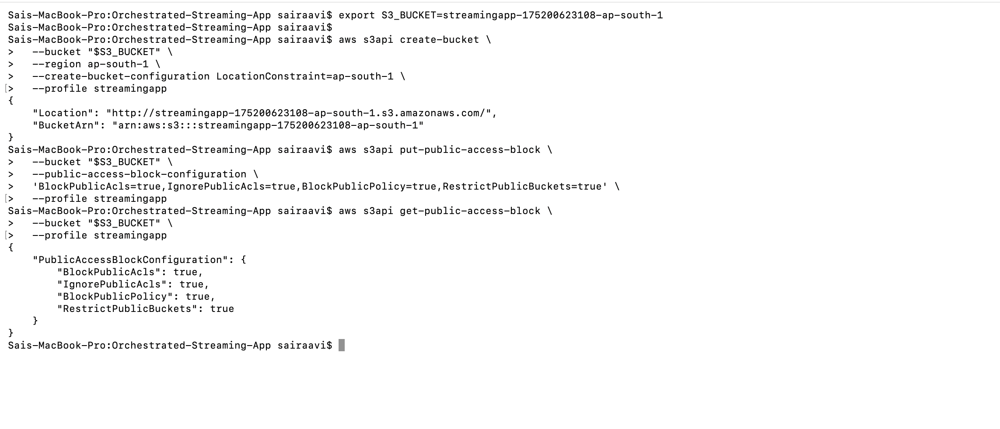

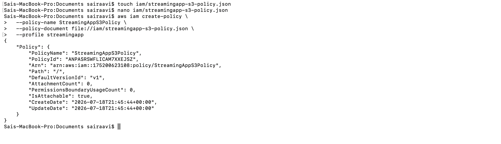


## End-to-End Deployment Validation

The application was tested through the NGINX load balancer endpoint. Registration and login succeeded. An admin user uploaded a video, Browse displayed it, and video playback succeeded from the deployed application.

```bash
kubectl get ingress streamingapp -n streamingapp
```

Open the `ADDRESS` returned by this command in a browser using `http://<load-balancer-address>`.


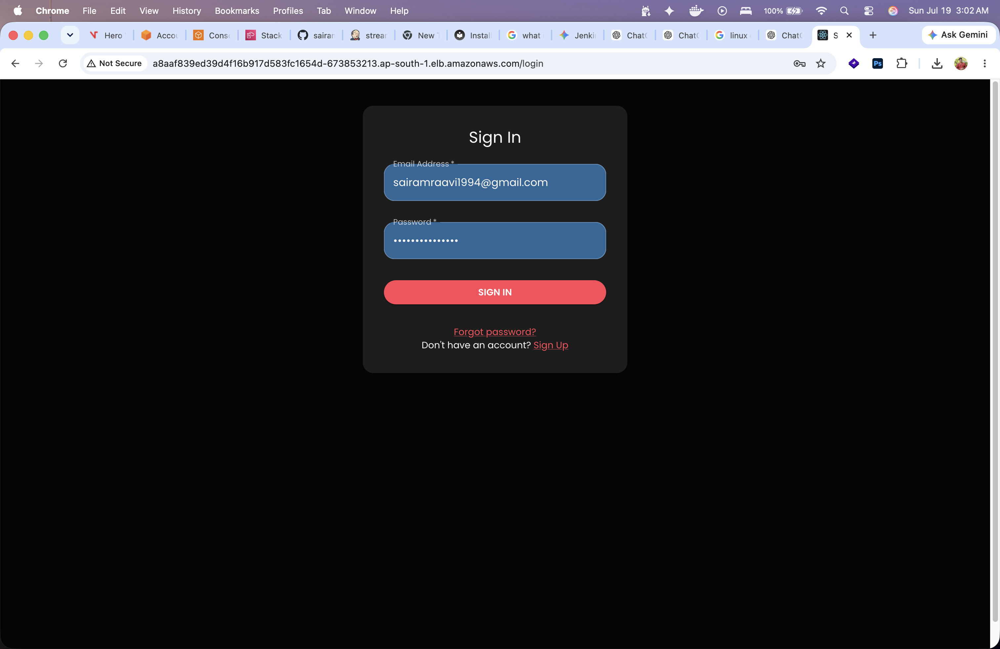

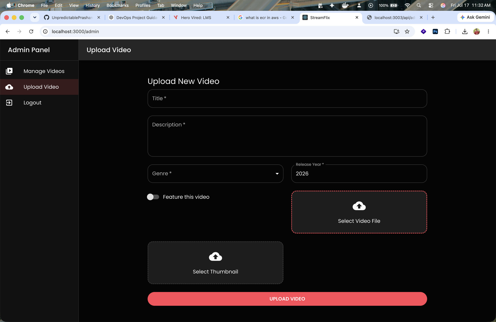


## Horizontal Pod Autoscaling

Horizontal Pod Autoscaler (HPA) automatically changes the number of service pods based on CPU and memory utilization. The chart creates HPAs for the backend services after metrics-server is available.

```bash
kubectl get hpa -n streamingapp
kubectl top pods -n streamingapp
```

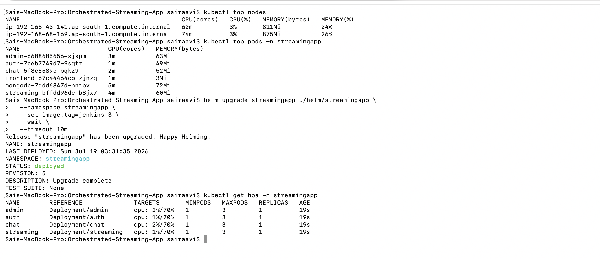

## CloudWatch Monitoring and Logging

Amazon CloudWatch Observability was enabled for the EKS cluster. Container Insights centralizes application, host, and data-plane logs, and provides Kubernetes workload visibility.

```bash
aws eks create-addon \
  --cluster-name streaming-eks \
  --addon-name amazon-cloudwatch-observability \
  --service-account-role-arn "<CLOUDWATCH_OBSERVABILITY_ROLE_ARN>" \
  --region ap-south-1 \
  --profile streamingapp

aws eks describe-addon \
  --cluster-name streaming-eks \
  --addon-name amazon-cloudwatch-observability \
  --region ap-south-1 \
  --profile streamingapp
```

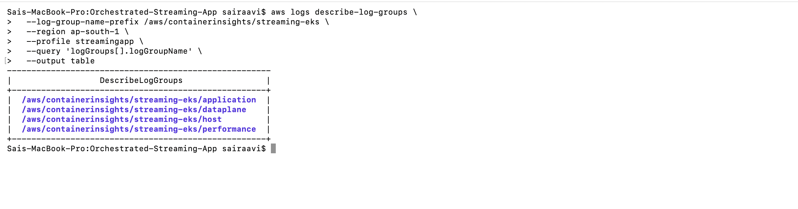


## SNS Notifications

An SNS topic delivers Jenkins build success and failure messages to confirmed email subscriptions.

```bash
aws sns create-topic \
  --name streamingapp-alerts \
  --region ap-south-1 \
  --profile streamingapp

aws sns subscribe \
  --topic-arn "<SNS_TOPIC_ARN>" \
  --protocol email \
  --notification-endpoint "<email-address>" \
  --region ap-south-1 \
  --profile streamingapp

aws sns publish \
  --region ap-south-1 \
  --topic-arn "<SNS_TOPIC_ARN>" \
  --subject 'StreamingApp SNS test' \
  --message 'Jenkins EC2 role can publish to SNS.'
```

After subscribing, the confirmation link in the email must be accepted before notifications can be delivered.

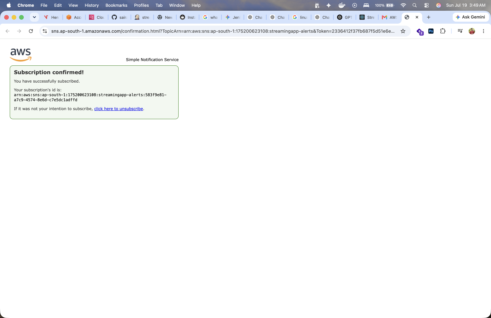

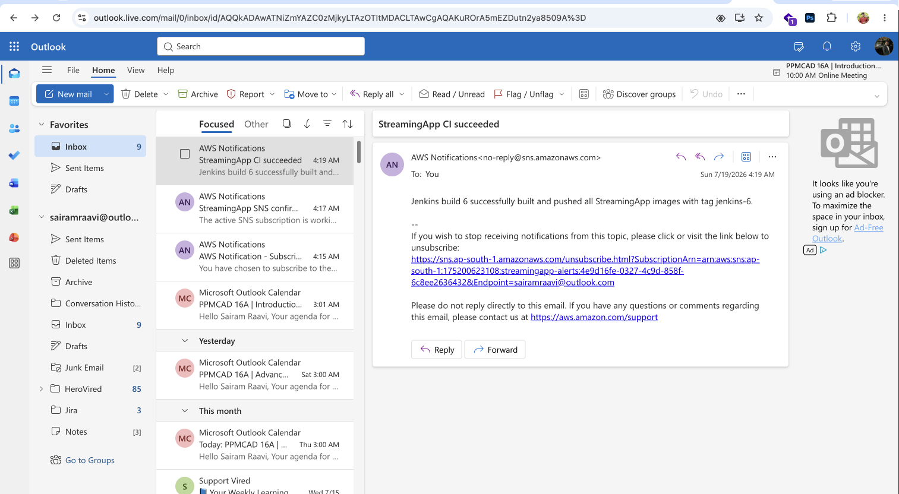

## Security Practices

- ECR repositories are private.
- S3 public access is fully blocked.
- Jenkins uses an EC2 IAM role rather than stored access keys.
- EKS pods use IRSA for scoped S3 access.
- The JWT secret is stored as a Kubernetes Secret and is not committed.
- Docker images use immutable Jenkins build-number tags.
- The original upstream repository is fetch-only.

## Final Validation Checklist

- [x] Source forked and upstream synchronization verified.
- [x] Application runs locally through Docker Compose.
- [x] Frontend and backend Docker images built for AMD64.
- [x] Five private ECR repositories contain application images.
- [x] Jenkins pipeline successfully builds and pushes images to ECR.
- [x] EKS cluster, NGINX Ingress, and Helm release are running.
- [x] All application pods and MongoDB PVC are healthy.
- [x] Registration, login, video upload, browse, and playback work through the public endpoint.
- [x] S3 video objects are private and accessed through IRSA.
- [x] HPA, CloudWatch logs, and SNS email notifications were verified.

## Cost Cleanup

AWS resources create charges while running. After evaluation, remove resources that are no longer needed.

```bash
helm uninstall streamingapp --namespace streamingapp
helm uninstall ingress-nginx --namespace ingress-nginx

AWS_PROFILE=streamingapp eksctl delete cluster \
  --name streaming-eks \
  --region ap-south-1

aws s3 rb "s3://$S3_BUCKET" --force --profile streamingapp
```

Terminate or stop the Jenkins EC2 instance only after the instructor has reviewed the Jenkins pipeline evidence.
